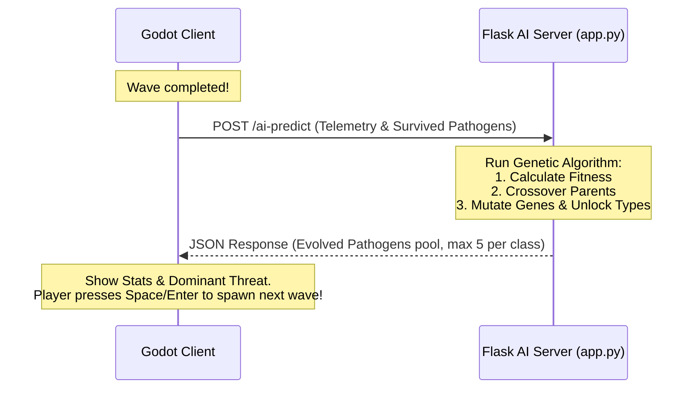

# Domainabus

**Domainabus** is a 2D top-down survival arena shooter set inside a petri dish (bloodstream). The player controls a white blood cell (immune system) tasked with defending a host body against waves of mutating, antimicrobial-resistant bacteria. 

The core twist of Domainabus is its **dynamically adapting enemy population**. An external **Genetic Algorithm (Python Flask API)** tracks player weapon usage and pathogen survival metrics to evolve the next wave of bacteria. As the player deploys different antibiotics, the pathogens develop resistance, change their compositions, and mutate into "superbugs."

---

## 👥 Team Information
* **Laudzan Ananda Syawaliandi** (140810240050) - Lead Developer
* **Hamdan Arif** (140810240055) - UI/UX Designer
* **Hosea Dave Anderson** (140810240089) - AI Developer

---

## 🔬 Core Features & Gameplay

1. **Host Defense Gameplay**: Survive waves of incoming pathogens. Heal to full between waves while inspecting the mutations of the next wave.
2. **Dynamic Adaptation System (AMR)**:
   - **Pistol (Beta-lactam)**: Safe, single-shot weapon with no cooldown. Modest mutation impact.
   - **Shotgun (Macrolide)**: 8-bullet spread with short cooldown. Medium mutation impact.
   - **Grenade Launcher (Cipro)**: Detonating Area-of-Effect explosive. High damage but triggers rapid pathogen mutations.
3. **Evolving Pathogens**:
   - **Bacteriophage (Regular)**: Standard chaser.
   - **Spirillum (Speedy)**: Sinusoidal zigzag chaser that relies on numbers.
   - **Coccus (Tanker)**: Extremely heavy, high-health, slow chaser.
   - When pathogens develop high resistance (>70%), they tint red to signal their "Superbug" status.
4. **Inter-Wave Mutation Overview**: Wave progression requires player confirmation. View the exact average resistance increases (Beta-lactam, Macrolide, Cipro) and dominant threats calculated in real-time by the AI before starting the next wave.
5. **Death pause & Safety**: Game state completely pauses on death, preventing duplicate deaths or background wave completions. Press Fire or Switch Weapon to restart immediately.

---

## 🛠️ Architecture & AI Integration

Domainabus uses a split-client architecture:
- **Client**: Built with Godot 4.6 (GDScript).
- **AI Backend**: Built with Python 3 (Flask).



### Telemetry Payload Format (Sent to Server)
```json
{
  "wave_number": 3,
  "weapon_telemetry": {
    "beta_lactam_shots": 120,
    "macrolide_pulse_shots": 250,
    "cipro_blast_shots": 15
  },
  "survived_pathogens": [
    {
      "class_type": "bacteriophage",
      "survival_time": 12.5,
      "damage_dealt": 8.0,
      "genes": {
        "res_beta_lactam": 0.2,
        "res_macrolide": 0.1,
        "res_cipro": 0.15
      }
    }
  ]
}
```

### Evolved Response Format (Received from Server)
```json
{
  "next_wave_number": 4,
  "spawn_count": 15,
  "pathogen_population": [
    {
      "id": 1,
      "class_type": "spirillum",
      "genes": {
        "res_beta_lactam": 0.25,
        "res_macrolide": 0.15,
        "res_cipro": 0.20
      }
    }
  ]
}
```

---

## 🧬 The Genetic Algorithm (`AI/app.py`)

- **Fitness Evaluation**: Surviving pathogens from the completed wave are evaluated based on their survival duration and damage dealt:
  $$\text{Fitness} = \text{Survival Time} + ( \text{Damage Dealt} \times 2 )$$
- **Selection & Crossover**: The top two fittest pathogens are selected as parents. Offspring inherit genes (crossover average) and class types from the parents.
- **Mutation**: Small random fluctuations ( $\pm 0.05$ ) are applied to the resistance values, clamped between $0.0$ and $0.95$ (ensuring bacteria are never completely invulnerable).
- **Wave progression unlocking**:
  - Wave 1 allows only `bacteriophage`.
  - Wave 2 unlocks and mixes in `spirillum`.
  - Wave 3+ unlocks and mixes in `coccus`.
  - Freshly unlocked classes are injected dynamically to seed the population.
- **Class Caps**: The AI caps the returned population pool to a maximum of **5 unique templates per class type** (maximum of 15 templates total) to encourage diversity without overwhelming the client.
- **Monotony Breaker**: There is a 25% chance the backend randomizes the dominant counter class rather than strictly countering the player's weapon, ensuring varied and surprising waves.
- **Client Fallback**: If the server is offline or fails to respond, the Godot client automatically generates fallback procedural values, guaranteeing smooth, uninterrupted gameplay.

---

## 🎮 How to Play

### Controls
- **W / A / S / D**: Move character.
- **Mouse Movement**: Aim weapon.
- **Left Mouse Click**: Fire weapon (hold for automatic).
- **R Key**: Cycle weapon (Pistol → Shotgun → Grenade Launcher).
- **Space / Enter**: Proceed to next wave (when prompt is visible).
- **Left Click / R (after death)**: Restart game.
- **Esc**: Pause menu & options.

### Running the Project

#### 1. [Optional if you want to run on your own machine] Start the Flask Backend
Make sure you have Python 3 and Flask installed:
```bash
pip install flask
```
Navigate to the `AI` directory and run:
```bash
python app.py
```
*The server will start locally on `http://127.0.0.1:5000`.*

#### 2. Run the Godot Client
Import and open the project in Godot 4.6+ and run the game. If the Flask server is running, you will see `[NetworkManager] Success!` prints in the Godot console at the end of each wave, showing successful AI evolution loops.

---

## ⚖️ Ethical Guardrails & Disclaimer

Domainabus is a casual educational simulation. 
- **Statistical Bounding**: Mutation resistance is bounded (max 0.95) so gameplay remains winnable.
- **Biological Bounding**: The AI processes purely abstract, macro-level probability percentages. No actual biological genomes, sequences, or infectious structures are used.
- **Medical Disclaimer**: The game presents a highly simplified representation of Antimicrobial Resistance (AMR) for educational entertainment. It does not reflect actual medical procedures or treatment timelines. Consult healthcare professionals for real-world medical advice.
